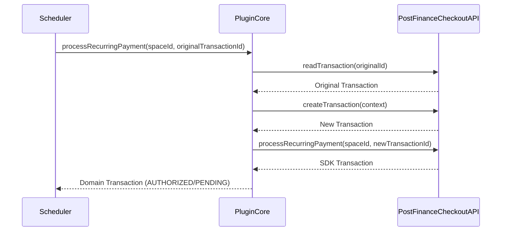

## Recurring Payments

The **Recurring Payment** functionality enables Merchant Initiated Transactions (MIT). This allows charging an existing transaction (representing a saved payment token) immediately without requiring direct user interaction in the browser.

This is commonly used for subscription renewals or unscheduled subsequent charges where the cardholder is not present.

### Core Concepts

**1. Process Without User Interaction**
The recurring payment process triggers a charge attempt on a previously successful transaction. It uses the payment information linked to that transaction.

**2. The Recurring Gateway**
The logic is encapsulated in the `RecurringTransactionGatewayInterface`. This interface exposes a specific method for processing recurring charges: `processRecurringPayment`.

**3. Token and Billing Address Requirements**
For a recurring payment to succeed, a valid payment token and billing address must be present on the original transaction. If either is missing, the service immediately throws a `\RuntimeException` (Fail Fast approach).

### Integration Guide

#### Step 1: Configure the Service

 Use `RecurringTransactionService`.

 ```php
 use PostFinanceCheckout\PluginCore\Transaction\RecurringTransactionService;
 use PostFinanceCheckout\PluginCore\Transaction\TransactionService;
 use PostFinanceCheckout\PluginCore\Sdk\WebServiceAPIV1\RecurringTransactionGateway;
 
 // Setup Gateway
 $recurringGateway = new RecurringTransactionGateway($sdkProvider, $logger);
 
 // Instantiate Recurring Service
 $recurringService = new RecurringTransactionService(
     $transactionService,
     $recurringGateway,
     $logger
 );
 ```

#### Step 2: Execute Recurring Payment

 The recurring payment is triggered using the original transaction ID and the space ID. If a token was not created during checkout, you must manually create it using the `TokenService` first.

 ```php
 use PostFinanceCheckout\PluginCore\Token\TokenService;
 use PostFinanceCheckout\PluginCore\Token\Exception\TokenException;
 use PostFinanceCheckout\PluginCore\Sdk\WebServiceAPIV1\TokenGateway;

 $tokenGateway = new TokenGateway($sdkProvider, $logger);
 $tokenService = new TokenService($tokenGateway, $logger);

 try {
     // If the original transaction has no token, create one. On failure this now
     // throws a TokenException carrying the gateway's localized rejection reason
     // (it no longer fails silently by returning null).
     $transaction = $transactionService->getTransaction($spaceId, $originalTransactionId);
     if ($transaction->token === null) {
         $transaction->token = $tokenService->createTokenForTransaction($spaceId, $originalTransactionId);
     }

     // Perform the recurring charge
     $newTransaction = $recurringService->processRecurringPayment($spaceId, $originalTransactionId);

     echo "Recurring payment processed! New Transaction ID: " . $newTransaction->id;

     // A recurring charge may resolve to FAILED; the localized failure reason is now preserved.
     if ($newTransaction->failureReason !== null) {
         echo "Failure reason: " . $newTransaction->failureReason->localize('en-US');
     }
 } catch (TokenException $e) {
     $logger->error("Token creation failed: " . ($e->getLocalizedReason()?->localize('en-US') ?? $e->getMessage()));
 } catch (\Throwable $e) {
     $logger->error("Recurring payment failed: " . $e->getMessage());
 }
 ```

### Flow Diagram



### Running the Example

A working example is provided in the `example` directory.

> [!IMPORTANT]
> The recurring payment example relies on a transaction that has already been authorized. You should run the Checkout examples first, complete the payment in your browser, and then run the recurring script.

1. **Start Checkout**: Run `docs/Checkout/example/1_start_checkout.php`.
2. **Confirm & Pay**: Run `docs/Checkout/example/3_confirm_checkout.php` and follow the link to pay.
3. **Trigger Recurring**: Run `docs/Recurring/example/recurring.php`.
    * This script automatically detects the active session from the Checkout example.
    * Alternatively, you can pass the transaction ID manually:

      ```bash
      php recurring.php <transaction_id>
      ```
